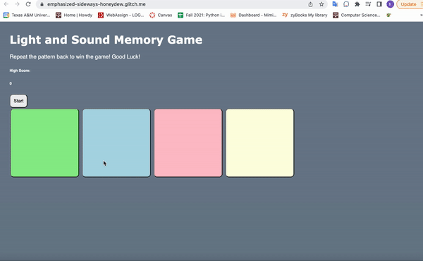

# Pre-work - *Memory Game*

**Memory Game** is a Light & Sound Memory game to apply for CodePath's SITE Program. 

Submitted by: Khanh Dao

Time spent: **4** hours spent in total

Link to project: (https://glitch.com/edit/#!/emphasized-sideways-honeydew)

## Required Functionality

The following **required** functionality is complete:

* [x] Game interface has a heading (h1 tag), a line of body text (p tag), and four buttons that match the demo app
* [x] "Start" button toggles between "Start" and "Stop" when clicked. 
* [x] Game buttons each light up and play a sound when clicked. 
* [x] Computer plays back sequence of clues including sound and visual cue for each button
* [x] Play progresses to the next turn (the user gets the next step in the pattern) after a correct guess. 
* [x] User wins the game after guessing a complete pattern
* [x] User loses the game after an incorrect guess

The following **optional** features are implemented:

* [ ] Any HTML page elements (including game buttons) has been styled differently than in the tutorial
* [x] Buttons use a pitch (frequency) other than the ones in the tutorial
* [ ] More than 4 functional game buttons
* [ ] Playback speeds up on each turn
* [ ] Computer picks a different pattern each time the game is played
* [ ] Player only loses after 3 mistakes (instead of on the first mistake)
* [ ] Game button appearance change goes beyond color (e.g. add an image)
* [ ] Game button sound is more complex than a single tone (e.g. an audio file, a chord, a sequence of multiple tones)
* [ ] User has a limited amount of time to enter their guess on each turn

The following **additional** features are implemented:

- [x] Adding high score tracking
- [x] User are displayed with their high score after losing(similar to Flappy Bird)

## Video Walkthrough (GIF)

If you recorded multiple GIFs for all the implemented features, you can add them here:

## Reflection Questions
1. If you used any outside resources to help complete your submission (websites, books, people, etc) list them here. 

    I did not use any outside resources to help complete my submission besides Codepath's Github instructions.

2. What was a challenge you encountered in creating this submission (be specific)? How did you overcome it? (recommended 200 - 400 words) 

    A challenge that I faced while creating this submission was relearning HTML, CSS, and Javascript after not working with these languages for almost a year. In class, the teacher mainly focused on C++ and Python for development, so I rarely got a chance to practice my web development skills. For example, I did not understand some of the Glitch's blank template code like the line: "<meta name="viewport" content="width=device-width, initial-scale=1" />." When I completed the Odin Project, a web development course, they didn't go into depth about setting meta tags as Glitch did for the blank project. I had to google up what these tags meant on Google and Stackoverflow to get the purpose of the line of code. Another example that I encountered was the "defer" statement after the <script> tag. I found out on google that "defer" basically means that it will execute the script once the document has been parsed.

3. What questions about web development do you have after completing your submission? (recommended 100 - 300 words) 

    Most of the questions that I had about web development were answered by either Google or StackOverflow. In question #2, I stated how I had to relearn some of the HTML and CSS concepts that I had forgotten after a year of not coding in either language. When it comes to web development, it seems like there are tons of resources that I can turn to if I ever need any help.

4. If you had a few more hours to work on this project, what would you spend them doing (for example: refactoring certain functions, adding additional features, etc). Be specific. (recommended 100 - 300 words) 

    If I had more time to work on this project, I would add more comments and functionality to the light and sound memory game. I wasn't able to implement some of the optional features like giving the player three lives on each turn or giving the player limited time on each turn. It would be interesting to make the game have a leaderboard where the player can enter a username so that they can be put onto a leaderboard. Instead of having a single-player game, many people can play the game under a different username, and whoever scores the highest would be on top of the leaderboard.

## Interview Recording URL Link

[My 5-minute Interview Recording]()

## License

    Copyright [KHANH DAO]

    Licensed under the Apache License, Version 2.0 (the "License");
    you may not use this file except in compliance with the License.
    You may obtain a copy of the License at

        http://www.apache.org/licenses/LICENSE-2.0

    Unless required by applicable law or agreed to in writing, software
    distributed under the License is distributed on an "AS IS" BASIS,
    WITHOUT WARRANTIES OR CONDITIONS OF ANY KIND, either express or implied.
    See the License for the specific language governing permissions and
    limitations under the License.
